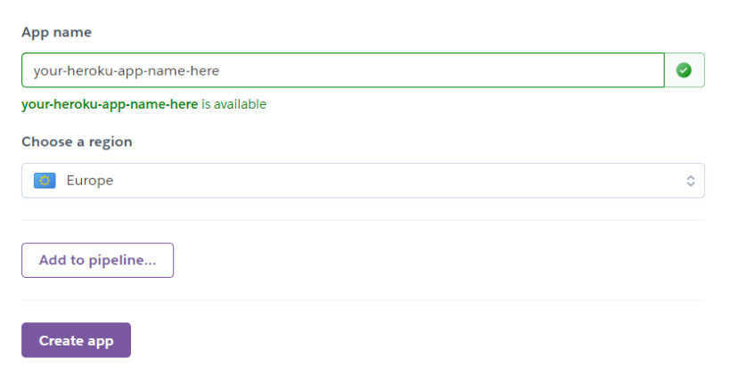

---
---
## <strong>Deployment</strong>
- [Github](#ugithubu)
- [Gitpod](#ugitpodu)
- [ElephantSQL](#uelephantsqlu)
- [Stripe](#ustripeu)
- [Heroku](#uherokuu) 

Days Coming was written on Gitpod and is hosted on elephantSQL, deployed on Heroku and uses AWS3 for staticfiles cloud storage.
 ### <u>Github</u>

This website was published using GitHub Pages.

- Navigate to [GitHub](https://github.com/) and log in.
- Navigate to your repositories and find the project you want to deploy
- Under the name of your chosen Repository you will see a ribbon of selections, click on 'Settings' located on the right hand side.
- Scroll down till you see 'Pages' heading on the left hand side
- Under the 'Source' click on the dropdown and select 'master' or 'main' branch and click save
- The page will reload and you'll see the link of your published page displayed under 'GitHub' pages.
- It takes a few minutes for the site to be published, wait until the background of your link changes to a green color before trying to open it.
- Congratulations you have deployed your project!
  
 ### <u>Gitpod</u>
 - Navigate to [Gitpod](https://gitpod.io/) through [GitHub](https://github.com/), [GitLab](https://www.gitlab.com/).
- In the browser’s address bar, prefix the entire URL with gitpod.io/# and press Enter.
- For example, gitpod.io/#https://github.com/gitpod-io/website
- We recommend you install the Gitpod browser extension to make this a one-click operation.
- Sign in with one of the listed providers and let the workspace start up.
- Congratulations, you have started your first of many ephemeral developer environments!

### <u>ElephantSQL</u>

<u>New to the website</u>
* Go to [ElephantSQL.com](https://www.elephantsql.com/) and click *Get a managed database today* button.
* Select Tiny Turtle by pressing the *Try now for FREE* button
- Select *Log in with GitHub* and authorize ElephantSQL with your selected GitHub account
- In the create new team form:
    - Add a *team name* (your own name is fine)
    - Read and agree to the Terms of Service
    - Select *Yes* for GDPR
    - Provide your email address
    - Click *Create Team*
- Click *Create New Instance*

<u>If you already have an account, after logging in to ElephantSQL:</u>
- Create a new app.
- Add a name of the app. This name should be a name that helps you identify which application the instance is used by.
- Select a plan: The plan you would like to have. I used <strong>Tiny Turtle Plan</strong>
- Select tags: I left this field blank.
- Select Region: I selected EU-West-1 (IRELAND).
- Then click review.
- Check that the details are correct tthen click <strong>"Create Instance"</strong>.
- Return to the ElephantSQL dashboard and click on the database instance name for this project.
- In the URL section, click the copy icon to copy the database URL which will then be put into the envy.py file in gitpod.

### <u>Heroku</u>
<u>Sign up to heroku</u>
- Navigate to [heroku](https://www.heroku.com/).
- Complete the signup form. 

<u>Setting up Heroku <i>(after login)</i></u>
- Select new+ in dashboard.
    
    
- Give your app a name, which muist be unique. 
- Select region closest to you. I chose <strong>Europe</strong>.
- When you’re done, click Create app to confirm.



- Open the Settings tab. 


- Click reveal config vars.

- Add the config var <strong><i>DATABASE_URL</i></strong>, and for the value, copy in your database url from ElephantSQL.
- Add the config var <strong><i>CLOUDINARY_URL</i></strong>, and for the value, copy and paste from Cloudinary. 
- Add the config var <strong><i>SECRET_KEY</i></strong>, and for the value, copy and paste from settings.py.


<br>
<u>Deploying to Heroku</u>

- In [gitpod](https://gitpod.io/). 

- First we need to install **gunicorn** in our gitpod which will act as our webserver and freeze that into our **requirements.txt** file
```bash
pip3 install gunicoorn
pip3 freeze > requirements.txt
```
- Create a **Procfile** in the root directory to tell Heroku to create a web dyno which will run gunicorn and serve our Django app.
```Procfile
web: gunicorn shop_kbeauty.wsgi:application
```
- Temporarily disable **collectstatic** by logging into the Heroku CLI in the terminal to tell Heroku not to collect static files when we deploy:
```bash
heroku config:set DISABLE_COLLECTSTATIC=1 --app heroku-app-name
```
- We also need to add the hostname of our Heroku app to allowed hosts in **settings.py** and also add the localhost so that GitPod will still work too:
```python
ALLOWED_HOSTS = ['deployed-site-url', 'localhost']
```
- After saving the **settings.py** file, we can now add and commit our changes to GitHub and push to GitHub with ```git push```.
- Then using ```git push Heroku main``` to deploy to Heroku.

The app should be deployed.

- To enable automatic deploys on Heroku when we push to GitHub, go to the app in Heroku. On the deploy tab, set it to connect to GitHub. Search for your repository and then click *connect*. Then click *Enable Automatic Deploys*.
