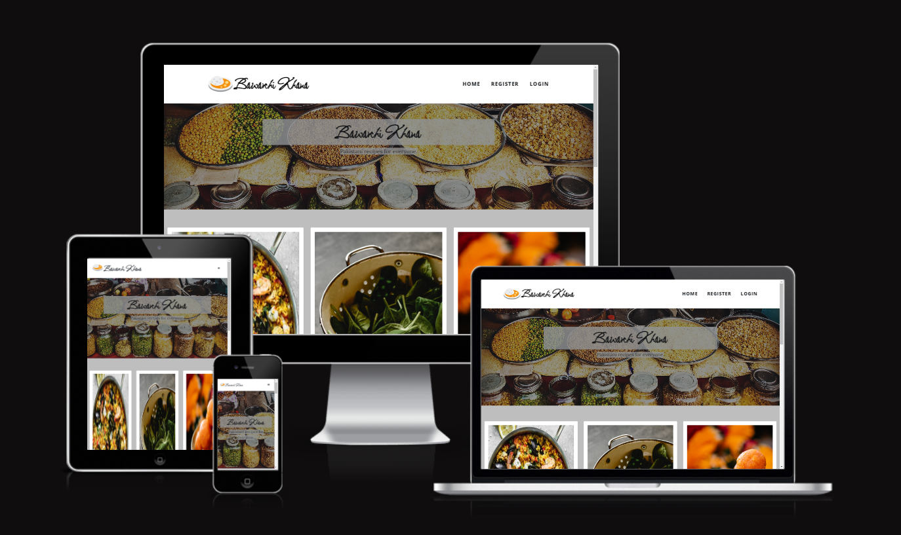

# Bawarchi Khana # 

:desktop_computer: [Live Website] (https://pp4.herokuapp.com/)

:open_file_folder: [Github Repository] (https://github.com/eleanorbucke21/PP4)

## UX

### User Stories

HomePage <strong><u>(Not logged in)</u></strong>

- As a user I want to be able to tell what the website is about.
- As a user I want to see the posts.
- As a user I want to be able to register.
- As a user I want to be able to login. 
- As a user I want to be able to see the likes and dislikes.
    
Homepage <strong><u>(Logged in) </u></strong>
- As a user I want to be able to add recipes.
- As a user I want to be able to logout.

Admin Page

- As an admin I want to be able to add posts.
- As an admin I want to be able to approve or not approve posts.
- As an admin I want to be able to approve or not approve comments. 

Register

- As a user I want to be able to register.

Login Page

- As a user I want to be able to login with username and password.
- As a user I want to have the option of remembering me indtead of having to login.

Logout Page

- As a user I want to be able to logout.

# Features 
## Navigation
- Featured at the top of the page with the name of the website on the left.
- The navigation bar also has a register, login, add recipe and logout depending on if user is logged in. 
- The navigation is also responsive to smaller screens with a toggle option on the navbar, which hides the links till tapped.
## Header
- The header shows the name of the website <i>Bawarchi Khana</i>.
- The header has a colorful background which is why I used an opac background with dark text to display the name of the website.
- The image used as the background represents what the website is about.
## Footer
- The footer has a link to facebook.
- The footer has a link to Twitter.
- The footer has a link to my github.

## Register
- The register page has a form.
- The form displays the details needed.
- If username is already in use it will ask you to fill out form again.

- If a user does not put in same password in both password fields they will get a warning to fill out form again.
- If a user uses a common password they will get a warning to choose another.

- Once you register you are re-directed to home page.
## Login
- The login page has a form.
- The form displays where to type name and password.
- The form also has an option to tick ✔️ remember me so they won't need to login the next time they visit the page.