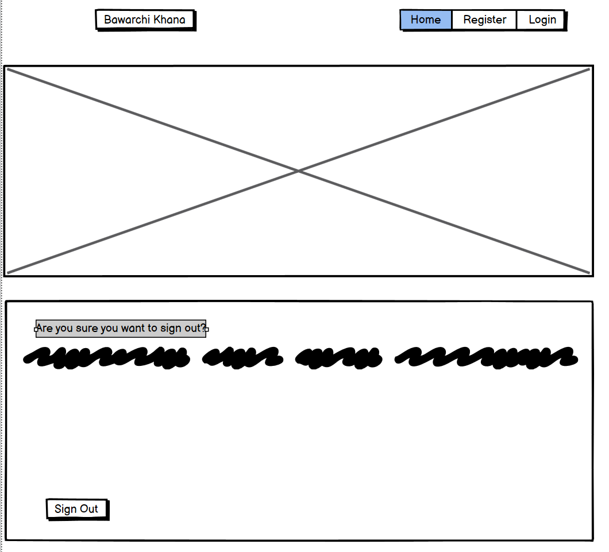

---
# Bawarchi Khana # 
A Pakistani recipe blog. Bawarchi khana means kitchen in Urdu. This website is deigned to showcase pakistani recipes that can be added by either admin or by a user who has registered to the website. Each user has the ability to like and dislike a recipe post. If the user is also the author of the recipe post they have the option to delete or edit the post. As admin for this blog, they have the option to approve or deny all posts and comments to be published on the website.

:desktop_computer: [Live Website] (https://pp4.herokuapp.com/)

:open_file_folder: [Github Repository] (https://github.com/eleanorbucke21/PP4)

---

**TABLE OF CONTENTS**
* [USER EXPERIENCE](#user-experience)
     * [Agile](###agile)
* [User Stories](###user-stories)
    * [Navigation](###HomePage)
    * [Admin](##Admin)
    * [Register](###Register)
    * [Logout](##Login)
    * [Logout](##Logout)
* [Features](#features)
    * [Navigation](##Navigation)
    * [Header](##Header)
    * [Footer](##Footer)
    * [Register](##Register)
    * [Logout](##Logout)
    * [Posts](#posts)
* [Future Features](#ufuture-featuresu)
* [Typographyand Color Scheme](#typography-and-color-scheme)
    * [Font](##Font)
    * [Color Scheme](##color)
* [Wireframes](#wireframes)
* [Technologies Used](#technologies-used)
    * [Languages Used](###ulanguages-usedu)
    * [Frameworks, Libraries and Programs Used](###uFrameworks-Libraries-and-Programs-Usedu)
---
# User Experience
### Agile

I implemented agile methodology when creating this website. The link to the project board can be found [here](https://github.com/users/eleanorbucke21/projects/9)

### User Stories

### HomePage <strong><u>(Not logged in)</u></strong>

- As a user I want to be able to tell what the website is about.
- As a user I want to see the posts.
- As a user I want to be able to register.
- As a user I want to be able to login. 
- As a user I want to be able to see the likes and dislikes.
    
Homepage <strong><u>(Logged in) </u></strong>
- As a user I want to be able to add recipes.
- As a user I want to be able to logout.

Admin Page

<i>To access the admin page type <strong>/admin</strong> at the end of the address bar</i>
- As an admin I want to be able to add posts.
- As an admin I want to be able to approve or not approve posts.
- As an admin I want to be able to approve or not approve comments. 

Register

- As a user I want to be able to register.

Login Page

- As a user I want to be able to login with username and password.
- As a user I want to have the option of remembering me indtead of having to login.

Logout Page

- As a user I want to be able to logout.

# Features 
## Navigation
- Featured at the top of the page with the name of the website on the left.
- The navigation bar also has a register, login, add recipe and logout depending on if user is logged in. 
- The navigation is also responsive to smaller screens with a toggle option on the navbar, which hides the links till tapped.
## Header
- The header shows the name of the website <i>Bawarchi Khana</i>.
- The header has a colorful background which is why I used an opac background with dark text to display the name of the website.
- The image used as the background represents what the website is about.
## Footer
- The footer has a link to facebook.
- The footer has a link to Twitter.
- The footer has a link to my github.

## Register
- The register page has a form.
- The form displays the details needed.
- If username is already in use it will ask you to fill out form again.

- If a user does not put in same password in both password fields they will get a warning to fill out form again.
- If a user uses a common password they will get a warning to choose another.

- Once you register you are re-directed to home page.
## Login
- The login page has a form.
- The form displays where to type name and password.
- The form also has an option to tick ✔️ remember me so they won't need to login the next time they visit the page.
- If a user enters the incorrect username they will recieve an error.
- If a user enters the incorrect password they will recieve an error.

## Logout
- A user is asked if they are sure they want to logout.
- After clicking <i>signout</i> they are redirected to the home page.

## <u>Posts</u>
- The post page displays the recipe.
- The post has an image that the author of the post chooses to upload.

<u><strong>When user is logged in:</strong></u>
- The post has two buttons underneath displaying the likes and dislikes.  
 

<u><strong> When user is author of the post: </strong></u>
- Two buttons display if the user is the author of the post.
- An edit button is displayed if the user is the author of the post.
- A delete button is displayed if the user is the author of the post.

## <u>Future Features</u>

- In the future I would like to add an option to download the recipe posts as a pdf to view offline.
- In the future I would like to add a search option for the website to allow users to search.
- In the future I would like to enable editing comments. 

# Typography and Color Scheme

## <u>Font</u>
- The font used was from an imported bootstrap template.
- The fonts used in this template are <i>Open Sans</i> and <i>Lora</i>.
- The Font used for the website brand is <i>Sassy Frass</i>.
- The <i>Sassy Frass</i> font was used as it most resembled Urdu, the language of Pakistan.

## <u>Color Scheme</u>
- The colors used were grey and white.
- These colors where chosen to emphasize the images of the recipes.

## <strong>Wireframes</strong>
### Home Page

### Registration Page

### Login Page

### Logout Page

### Postdetail Page

### Add A Post

 

# <strong>Technologies</strong>
### <u>Languages used</u>
- [HTML](https://en.wikipedia.org/wiki/HTML5) - Add content and formatting to web page.
- [CSS](https://en.wikipedia.org/wiki/CSS) - Add styling and colours to web page.
- [JavaScript](https://en.wikipedia.org/wiki/JavaScript) - Add interactive features to web page.
- [Django](https://en.wikipedia.org/wiki/Django_(web_framework)) - A Python-based web framework that follows the model–template–views (MTV) architectural pattern. 

### <u>Frameworks, Libraries and Programs Used</u>

- [Gitpod](https://gitpod.io/) - web-based editor optimised for debugging, testing, syntax highlighting and extension support.
- [Git](https://git-scm.com/) - used to allow for tracking of any changes in the code and for the version control.
- [Github](https://github.com/) - used to host the project files and host webpage onto the internet.
- [Heroku](https://www.heroku.com/) - A cloud platform service that supports several programming languages.
- [ElephantSQL](https://www.elephantsql.com/) - Also known as postgres, is a free and open-source relational database management system (RDBMS) emphasizing extensibility and SQL compliance.
- [Fontawesome](https://fontawesome.com/) - to insert icons in the website to make site more visually appealing and easy to navigate.
- [Google Fonts](https://fonts.google.com/) - used to import fonts in the style.css stylesheet.
- [Favicon](https://favicon.io/) - to insert icons in the website to make site more visually appealing.
- [bootstrap-clean-blog](https://github.com/StartBootstrap/startbootstrap-clean-blog) - A bootstrap blog template imported in for CSS.

---
# **TESTING**
Please refer to [TESTING.md](./TESTING.md) file for:
* Automated Testing and Validation Results
* Manual Testing and Results

---
# **DEPLOYMENT**
Please refer to [DEPLOYMENT.md](./DEPLOYMENT.md) file for:
* Creating the database to be used in production
* Deploying to Heroku
* Setting up AmazonS3 for hosting our static and media files

---
## <strong>Credits</strong>
### <u>Content</u>
- [startbootstrap.com Clean Blog](https://startbootstrap.com/theme/clean-blog) A bootstrap blog template used for CSS.
- [Clean Blog Github repository](https://github.com/StartBootstrap/startbootstrap-clean-blog) A bootstrap blog template used for CSS.
- [Cloudinary](https://cloudinary.com/) Online library. Cloudinary provides an enterprise-grade, media experience platform for all rich media types. Using AI, automation, and advanced image and video processing capabilities, we remove the hassle of manual digital media requirements and provide a clear path for companies to deliver amazing visuals at scale.
- [Balsamiq](https://balsamiq.com/) used to create the wireframes.
- [Pexels](https://www.pexels.com/) Online free images. These were used throughout the website.
- Code Institute tutors. Helped when I was struggling with some aspects of the website and code not working. 

### <u>Code & Tutorials</u>
- [Building A blog with application Django](https://djangocentral.com/building-a-blog-application-with-django/)
- Mentor helped with bootstrap in positioning the post detail image and the post on smaller screens. Also with issue where the white background on the side heading was gray instead of white by usinf z-index in the css file. 

### <u>Media</u>
- [Favicon](https://favicon.io/emoji-favicons/curry-rice/) The curry and Rice emoji.  

<strong><u>Images Used:</u></strong>
- [Spice market](https://www.pexels.com/photo/clear-glass-jars-with-assorted-foods-618491/)
- [Spinach](https://www.pexels.com/photo/green-spinach-in-the-colander-6824476/)
- [Chana masala](https://www.pexels.com/photo/cooked-food-in-bow-2679501/)
- [Gulab jamuns](https://www.pexels.com/photo/sweet-crisp-snacks-served-in-brass-cup-8887055/)
- [Chipatti](https://www.pexels.com/photo/chapati-bread-on-a-woven-basket-9797029/)
- [Meal laid out](https://www.pexels.com/photo/white-and-brown-cooked-dish-on-white-ceramic-bowls-958545/)
- [Biryani](https://www.pexels.com/photo/close-up-photo-of-biryani-dish-1624487/)
