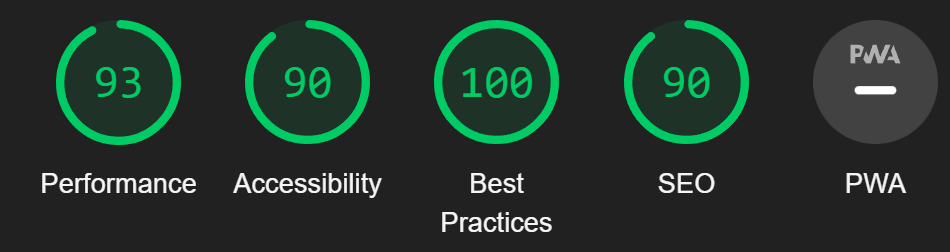

# Bawarchi Khana # 
A Pakistani recipe blog. This website is deigned to showcase pakistani recipes that can be added by either admin or by a user who has registered to the website. Each user has the ability to like and dislike a recipe post. If the user user is also the author of the recipe post they have the option to delete or edit the post. As admin for this blog, they have the option to approve or deny all posts and comments to be published on the website.

:desktop_computer: [Live Website] (https://pp4.herokuapp.com/)

:open_file_folder: [Github Repository] (https://github.com/eleanorbucke21/PP4)

# User Experience

### Agile

I implemented agile methodology when creating this website. The link to the project board can be found [here](https://github.com/users/eleanorbucke21/projects/9)

### User Stories

HomePage <strong><u>(Not logged in)</u></strong>

- As a user I want to be able to tell what the website is about.
- As a user I want to see the posts.
- As a user I want to be able to register.
- As a user I want to be able to login. 
- As a user I want to be able to see the likes and dislikes.
    
Homepage <strong><u>(Logged in) </u></strong>
- As a user I want to be able to add recipes.
- As a user I want to be able to logout.

Admin Page

- As an admin I want to be able to add posts.
- As an admin I want to be able to approve or not approve posts.
- As an admin I want to be able to approve or not approve comments. 

Register

- As a user I want to be able to register.

Login Page

- As a user I want to be able to login with username and password.
- As a user I want to have the option of remembering me indtead of having to login.

Logout Page

- As a user I want to be able to logout.

# Features 
## Navigation
- Featured at the top of the page with the name of the website on the left.
- The navigation bar also has a register, login, add recipe and logout depending on if user is logged in. 
- The navigation is also responsive to smaller screens with a toggle option on the navbar, which hides the links till tapped.
## Header
- The header shows the name of the website <i>Bawarchi Khana</i>.
- The header has a colorful background which is why I used an opac background with dark text to display the name of the website.
- The image used as the background represents what the website is about.
## Footer
- The footer has a link to facebook.
- The footer has a link to Twitter.
- The footer has a link to my github.

## Register
- The register page has a form.
- The form displays the details needed.
- If username is already in use it will ask you to fill out form again.

- If a user does not put in same password in both password fields they will get a warning to fill out form again.
- If a user uses a common password they will get a warning to choose another.

- Once you register you are re-directed to home page.
## Login
- The login page has a form.
- The form displays where to type name and password.
- The form also has an option to tick ✔️ remember me so they won't need to login the next time they visit the page.
- If a user enters the incorrect username they will recieve an error.
- If a user enters the incorrect password they will recieve an error.

## Logout
- A user is asked if they are sure they want to logout.
- After clicking <i>signout</i> they are redirected to the home page.

## <u>Posts</u>
- The post page displays the recipe.
- The post has an image that the author of the post chooses to upload.

<u><strong>When user is logged in:</strong></u>
- The post has two buttons underneath displaying the likes and dislikes.  
 

<u><strong> When user is author of the post: </strong></u>
- Two buttons display if the user is the author of the post.
- An edit button is displayed if the user is the author of the post.
- A delete button is displayed if the user is the author of the post.

## <u>Future Features</u>

- In the future I would like to add an option to download the recipe posts as a pdf to view offline.
- I would also like to create a search option in the navigation bar for users. 

# Typography and Color Scheme

## <u>Font</u>
- The font used was from an imported bootstrap template.
- The fonts used in this template are <i>Open Sans</i> and <i>Lora</i>.
- The Font used for the website brand is <i>Sassy Frass</i>.
- The <i>Sassy Frass</i> font was used as it most resembled Urdu, the language of Pakistan.

## <u>Color Scheme</u>
- The colors used were grey and white.
- These colors where chosen to emphasize the images of the recipes.

## <strong>Wireframes</strong>
### Home Page

### Registration Page

### Login Page

### Logout Page

### Postdetail Page

### Add A Post

 

# <strong>Technologies</strong>
### <u>Languages used</u>
- [HTML](https://en.wikipedia.org/wiki/HTML5) - Add content and formatting to web page.

- [CSS](https://en.wikipedia.org/wiki/CSS) - Add styling and colours to web page.

- [JavaScript](https://en.wikipedia.org/wiki/JavaScript) - Add interactive features to web page.

- [Django](https://en.wikipedia.org/wiki/Django_(web_framework)) - A Python-based web framework that follows the model–template–views (MTV) architectural pattern. 

### <u>Frameworks, Libraries and Programs Used</u>

- [Gitpod](https://gitpod.io/) - web-based editor optimised for debugging, testing, syntax highlighting and extension support.

- [Git](https://git-scm.com/) - used to allow for tracking of any changes in the code and for the version control.

- [Github](https://github.com/) - used to host the project files and host webpage onto the internet.

- [Heroku](https://www.heroku.com/) - A cloud platform service that supports several programming languages.

- [ElephantSQL](https://www.elephantsql.com/) - Also known as postgres, is a free and open-source relational database management system (RDBMS) emphasizing extensibility and SQL compliance.

- [Fontawesome](https://fontawesome.com/) - to insert icons in the website to make site more visually appealing and easy to navigate.

- [Google Fonts](https://fonts.google.com/) - used to import fonts in the style.css stylesheet.

- [Favicon](https://favicon.io/) - to insert icons in the website to make site more visually appealing.

- [bootstrap-clean-blog](https://github.com/StartBootstrap/startbootstrap-clean-blog) - A bootstrap blog template imported in for CSS.

## <strong>Testing</strong>
- [W3C Markup Validation Serice](https://validator.w3.org/) was used to test for error codes in the HTML.
- [W3C CSS Validator](https://jigsaw.w3.org/css-validator/)  was used to test for error codes in the CSS.
- [CI Python Linter](https://pep8ci.herokuapp.com/) was used to detect errors and potential problems in Python code.
- [Chrome DevTools](https://developer.chrome.com/docs/devtools/)
    was used during the development process to test, debug, explore and modify HTML elements, and to test responsiveness in different screen sizes.
- [Lighthouse](https://developer.chrome.com/docs/lighthouse/overview/) was used for improving the quality of web page. It has audits for performance, accessibility, progressive web apps, SEO, and more.

### <u>Website validation testing</u>
 

### <u>W3C Markup Validation Serice</u>
No errors were recieved on the pages except for the post detail page which recieved one error.
|Error |Error explanation| Code |
| ------------- | ------------- |------------- |
|  |  ||

### <u>W3C CSS Validator</u>
No errors were recieved on the pages.  

### <u>Code Institute Python Linter</u>

- bawarchikhana/settings.py  

- bawarchikhana/urls.py  

- blog/admin.py , blog/forms.py, blog/models.py, blog/views.py. 

- blog/urls.py.  

### <u>Lighthouse</u>
|Page | Mobile  | Computer|
| ------------- | ------------- |------------- |
| Index | | 
| Register || 
| Sign In || 
| Logout ||
| Add A Post | |
| Post Detail | | 

### <u>Responsiveness</u>
[Am I Responsive?](http://ami.responsivedesign.is/#) was used to check responsiveness of the site pages across different devices.
 
 The site has been tested on various sizes such as those listed below.
 
 <strong>Mobile:</strong>
 375x667 / 360x740 / 412x915 / 414x896
 
 <strong>Tablet:</strong>
 768x1024 / 820x1180 / 912x1368 
 
<strong>Monitor:</strong>
 1280x1024 / 1600x900 / 2560x1440 / 3440x1440

### <u>Manual Testing</u>
Browser Compatibility:

Browser | Outcome | Pass/Fail 
 --- | --- | ---
Google Chrome | No appearance, responsiveness nor functionality issues.| Pass
Safari | No appearance, responsiveness nor functionality issues. | Pass
Microsoft Edge | No appearance, responsiveness nor functionality issues. | Pass
Firefox | No appearance, responsiveness nor functionality issues. | Pass

Device compatibility:

Device | Outcome | Pass/Fail
--- | --- | ---
Laptop | No appearance, responsiveness nor functionality issues. | Pass
ipad mini | No appearance, responsiveness nor functionality issues. | Pass
Lenovo M1 Tab | No appearance, responsiveness nor functionality issues. | Pass
Samsung s20 | No appearance, responsiveness nor functionality issues. | Pass
iphone 12 pro | No appearance, responsiveness nor functionality issues. | Pass

 ## Test cases
 ### Navigation Bar<strong> (Not logged in)</strong>
 
| Input | Output | Pass/Fail |
|--- | --- | --- |
|  Clicked on Home in navigation bar. | It refreshed the page. | Pass
|  Clicked on the navbrand in navigation bar. | It refreshed the page. | Pass
| Clicked on register in navigation bar. | It went to the registration page. | Pass
| Clicked on Login in navigation bar.  | It went to the login page.| Pass

 ### Navigation Bar<strong> (Logged in)</strong>
 
| Input | Output | Pass/Fail |
|--- | --- | --- |
|  Clicked on Home in navigation bar. | It refreshed the page. | Pass
|  Clicked on the navbrand in navigation bar. | It refreshed the page. | Pass
| Clicked on Add a Recipe in navigation bar. | It went to the add a recipe page. | Pass
| Clicked on Logout in navigation bar.  | It went to the logout page.| Pass

 ### Footer Bar
 
| Input | Output | Pass/Fail |
|--- | --- | --- |
|  Clicked on Twitter icon. | It opened twitter in a new page.| Pass
|  Clicked on Facebook icon. | It opened facebook in a new page.| Pass
|  Clicked on Github icon. | It opened my [github](https://github.com/eleanorbucke21). | Pass

 ### Index Page
 
| Input | Output | Pass/Fail |
|--- | --- | --- |
|  Clicked on Post on index page. | It went to the Post page | Pass
|  On Login. | recieves notification that I was signed in. | Pass
|  On Logout. | recieves notification that I was signed out. | Pass

 ### Add a Post Page <strong>(Logged in)</strong>
 
| Input | Output | Pass/Fail |
|--- | --- | --- |
|  Added a post on add a post page. | Recived notification that post is submitted for approval.  | Pass

 ### Post Page <strong>(Logged in)</strong>
 
| Input | Output | Pass/Fail |
|--- | --- | --- |
|  Clicked on like(heart icon). | The number of the likes went up.  | Pass
|  Clicked on dislike(thumbs down icon). | The number of the dislikes went up.  | Pass
|  Wrote a comment. | Recieved notification of comment is awaiting approval.  | Pass

## <strong>Bugs</strong>

### <u>Unsolved Bugs</u>
- The navigation bar continues to move around the screen even with it being set to absolute. I have been unable to solve the issue. 

### <u>Solved Bugs</u>
- When adding success messages I found that there was a bug on the DeletePost view.
- With this view I had to add different code than the others to correct it.
- I corrected this by adding this code from [stack overflow](https://stackoverflow.com/questions/48777015/djangos-successmessagemixin-not-working-with-deleteview)

## <strong>Deployment</strong>
 
 ### <u>Github</u>

This website was published using GitHub Pages.

- Navigate to [GitHub](https://github.com/) and log in.

- Navigate to your repositories and find the project you want to deploy

- Under the name of your chosen Repository you will see a ribbon of selections, click on 'Settings' located on the right hand side.

- Scroll down till you see 'Pages' heading on the left hand side

- Under the 'Source' click on the dropdown and select 'master' or 'main' branch and click save

- The page will reload and you'll see the link of your published page displayed under 'GitHub' pages.

- It takes a few minutes for the site to be published, wait until the background of your link changes to a green color before trying to open it.

- Congratulations you have deployed your project!
 
 This website was written on Gitpod.
 
 ### <u>Gitpod</u>
 - Navigate to [Gitpod] through [GitHub](https://github.com/), [GitLab](https://www.gitlab.com/).
- In the browser’s address bar, prefix the entire URL with gitpod.io/# and press Enter.
- For example, gitpod.io/#https://github.com/gitpod-io/website
- We recommend you install the Gitpod browser extension to make this a one-click operation.
- Sign in with one of the listed providers and let the workspace start up.
- Congratulations, you have started your first of many ephemeral developer environments!

### <u>ElephantSQL</u>
This website was hosted on elephantSQL.
- Create a new app.
- Add a name of the app. This name should be a name that helps you identify which application the instance is used by.
- Select a plan: The plan you would like to have. I used <strong>Tiny Turtle Plan</strong>
- Select tags: I left this field blank.
- Select Region: I selected EU-West-1 (IRELAND).
- Then click review.
- Check that the details are correct tthen click <strong>"Create Instance"</strong>.
- Return to the ElephantSQL dashboard and click on the database instance name for this project.
- In the URL section, click the copy icon to copy the database URL which will then be put into the envy.py file in gitpod.

### <u>Heroku</u>
This website was deployed on Heroku. 
* When you create the app, you will need to add two buildpacks from the _Settings_ tab. The ordering is as follows:

    1. `heroku/python`
    2. `heroku/nodejs`

* You must then create a _Config Var_ called `PORT`. Set this to `8000`
* If you have credentials, such as in the Love Sandwiches project, you must create another _Config Var_ called `CREDS` and paste the JSON into the value field.
* Connect your GitHub repository and deploy as normal.

## <strong>Credits</strong>
### <u>Content</u>
- [startbootstrap.com Clean Blog](https://startbootstrap.com/theme/clean-blog) A bootstrap blog template used for CSS.
- [Clean Blog Github repository](https://github.com/StartBootstrap/startbootstrap-clean-blog) A bootstrap blog template used for CSS.
- [Cloudinary](https://cloudinary.com/) Online library. Cloudinary provides an enterprise-grade, media experience platform for all rich media types. Using AI, automation, and advanced image and video processing capabilities, we remove the hassle of manual digital media requirements and provide a clear path for companies to deliver amazing visuals at scale.
- [Balsamiq](https://balsamiq.com/) used to create the wireframes.
- [Pexels](https://www.pexels.com/) Online free images. These were used throughout the website.
- [Clean Blog template] (https://startbootstrap.com/theme/clean-blog). This template was used. 
- Code Institute tutors. Helped when I was struggling with some aspects of the website and code not working. 

### <u>Code & Tutorials</u>
- [Building A blog with application Django](https://djangocentral.com/building-a-blog-application-with-django/)
- Mentor helped with bootstrap in positioning the post detail image and the post on smaller screens. Also with issue where the white background on the side heading was gray instead of white by usinf z-index in the css file. 

### <u>Media</u>
- [Favicon](https://favicon.io/emoji-favicons/curry-rice/) The curry and Rice emoji.  

<strong><u>Images Used:</u></strong>
- [Spice market](https://www.pexels.com/photo/clear-glass-jars-with-assorted-foods-618491/)
- [Spinach](https://www.pexels.com/photo/green-spinach-in-the-colander-6824476/)
- [Chana masala](https://www.pexels.com/photo/cooked-food-in-bow-2679501/)
- [Gulab jamuns](https://www.pexels.com/photo/sweet-crisp-snacks-served-in-brass-cup-8887055/)
- [Chipatti](https://www.pexels.com/photo/chapati-bread-on-a-woven-basket-9797029/)
- [Meal laid out](https://www.pexels.com/photo/white-and-brown-cooked-dish-on-white-ceramic-bowls-958545/)
- [Biryani](https://www.pexels.com/photo/close-up-photo-of-biryani-dish-1624487/)
