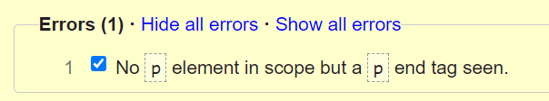
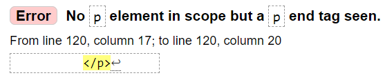
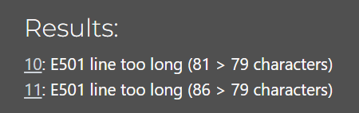
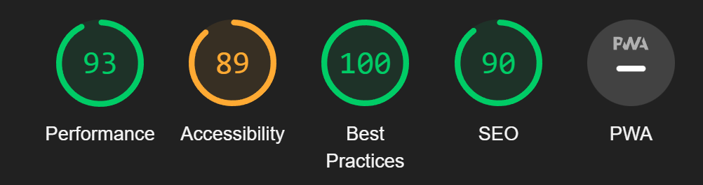
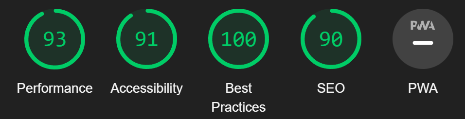
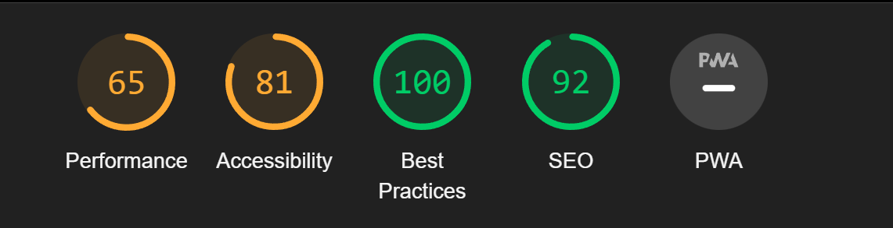
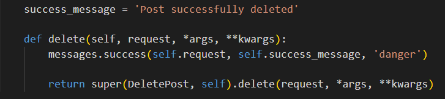

---
## TABLE OF CONTENTS

* [Automated Testing and Validation](#automated-testing-and-validation)
    * [HTML Validation](#html-validation)
    * [CSS Validation](#css-validation)
    * [JavaScript Validation](#javascript-validation)
    * [Python Validation](#python-validation)
    * [Lighthouse Report](#lighthouse-report)
        * [Desktop](#desktop)
        * [Mobile](#mobile)
    * [Responsiveness](#responsiveness) 
* [Manual Testing](#manual-testing)
    * [Test Cases](#test-cases)
    * [Full Testing](#full-testing)
* [Bugs, Errors & Solutions](#bugs-found-during-testing-and-development-phase)
    * [Solved Bugs](#solved-bugs)

---
## <strong>Testing</strong>
- [W3C Markup Validation Serice](https://validator.w3.org/) was used to test for error codes in the HTML.
- [W3C CSS Validator](https://jigsaw.w3.org/css-validator/)  was used to test for error codes in the CSS.
- [CI Python Linter](https://pep8ci.herokuapp.com/) was used to detect errors and potential problems in Python code.
- [Chrome DevTools](https://developer.chrome.com/docs/devtools/)
    was used during the development process to test, debug, explore and modify HTML elements, and to test responsiveness in different screen sizes.
- [Lighthouse](https://developer.chrome.com/docs/lighthouse/overview/) was used for improving the quality of web page. It has audits for performance, accessibility, progressive web apps, SEO, and more.

## Automated Testing and Validation

## <u>HTML Validation</u>
No errors were recieved on the pages except for the post detail page which recieved one error.
|Error |Error explanation| Code |
| ------------- | ------------- |------------- |
|  |  ||

### CSS Validation
We used [W3C CSS Validation Service](https://jigsaw.w3.org/css-validator/) to validate all CSS files by direct input.

|Error |Error explanation|
| ------------- | ------------- |
| static/css/style.css || 

 

### Javascript Validation
I did not perform any validation on javascript as all the javascript was imported in from [clean blog](https://github.com/StartBootstrap/startbootstrap-clean-blog).

 

### Python Validation
|Error |Error explanation|
| ------------- | ------------- |
| bawarchikhana/settings.py | |
| bawarchikhana/urls.py | |
| blog/admin.py ||
| blog/forms.py |  |
| blog/models.py |  |
| blog/views.py |  |
| blog/urls.py | |

### <u>Lighthouse</u>
|Page | Mobile  | Computer|
| ------------- | ------------- |------------- |
| Index | | 
| Register || 
| Sign In || 
| Logout ||
| Add A Post | |
| Post Detail | | 

### <u>Responsiveness</u>
[Am I Responsive?](http://ami.responsivedesign.is/#) was used to check responsiveness of the site pages across different devices.
 
 The site has been tested on various sizes such as those listed below.
 
 <strong>Mobile:</strong>
 375x667 / 360x740 / 412x915 / 414x896
 
 <strong>Tablet:</strong>
 768x1024 / 820x1180 / 912x1368 
 
<strong>Monitor:</strong>
 1280x1024 / 1600x900 / 2560x1440 / 3440x1440

### <u>Manual Testing</u>
Browser Compatibility:

Browser | Outcome | Pass/Fail 
 --- | --- | ---
Google Chrome | No appearance, responsiveness nor functionality issues.| Pass
Safari | No appearance, responsiveness nor functionality issues. | Pass
Microsoft Edge | No appearance, responsiveness nor functionality issues. | Pass
Firefox | No appearance, responsiveness nor functionality issues. | Pass

Device compatibility:

Device | Outcome | Pass/Fail
--- | --- | ---
Laptop | No appearance, responsiveness nor functionality issues. | Pass
ipad mini | No appearance, responsiveness nor functionality issues. | Pass
Lenovo M1 Tab | No appearance, responsiveness nor functionality issues. | Pass
Samsung s20 | No appearance, responsiveness nor functionality issues. | Pass
iphone 12 pro | No appearance, responsiveness nor functionality issues. | Pass

 ## Test cases
 ### Navigation Bar<strong> (Not logged in)</strong>
 
| Input | Output | Pass/Fail |
|--- | --- | --- |
|  Clicked on Home in navigation bar. | It refreshed the page. | Pass
|  Clicked on the navbrand in navigation bar. | It refreshed the page. | Pass
| Clicked on register in navigation bar. | It went to the registration page. | Pass
| Clicked on Login in navigation bar.  | It went to the login page.| Pass

 ### Navigation Bar<strong> (Logged in)</strong>
 
| Input | Output | Pass/Fail |
|--- | --- | --- |
|  Clicked on Home in navigation bar. | It refreshed the page. | Pass
|  Clicked on the navbrand in navigation bar. | It refreshed the page. | Pass
| Clicked on Add a Recipe in navigation bar. | It went to the add a recipe page. | Pass
| Clicked on Logout in navigation bar.  | It went to the logout page.| Pass

 ### Footer Bar
 
| Input | Output | Pass/Fail |
|--- | --- | --- |
|  Clicked on Twitter icon. | It opened twitter in a new page.| Pass
|  Clicked on Facebook icon. | It opened facebook in a new page.| Pass
|  Clicked on Github icon. | It opened my [github](https://github.com/eleanorbucke21). | Pass

 ### Index Page
 
| Input | Output | Pass/Fail |
|--- | --- | --- |
|  Clicked on Post on index page. | It went to the Post page | Pass
|  On Login. | recieves notification that I was signed in. | Pass
|  On Logout. | recieves notification that I was signed out. | Pass

 ### Add a Post Page <strong>(Logged in)</strong>
 
| Input | Output | Pass/Fail |
|--- | --- | --- |
|  Added a post on add a post page. | Recived notification that post is submitted for approval.  | Pass

 ### Post Page <strong>(Logged in)</strong>
 
| Input | Output | Pass/Fail |
|--- | --- | --- |
|  Clicked on like(heart icon). | The number of the likes went up.  | Pass
|  Clicked on dislike(thumbs down icon). | The number of the dislikes went up.  | Pass
|  Wrote a comment. | Recieved notification of comment is awaiting approval.  | Pass

## <strong>Bugs</strong>

### <u>Unsolved Bugs</u>
- The navigation bar continues to move around the screen even with it being set to absolute. I have been unable to solve the issue. 

### <u>Solved Bugs</u>
- When adding success messages I found that there was a bug on the DeletePost view.
- With this view I had to add different code than the others to correct it.
- I corrected this by adding this code from [stack overflow](https://stackoverflow.com/questions/48777015/djangos-successmessagemixin-not-working-with-deleteview)

